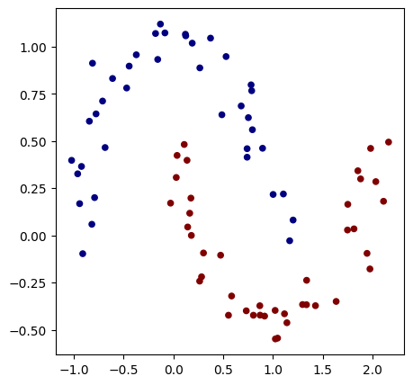
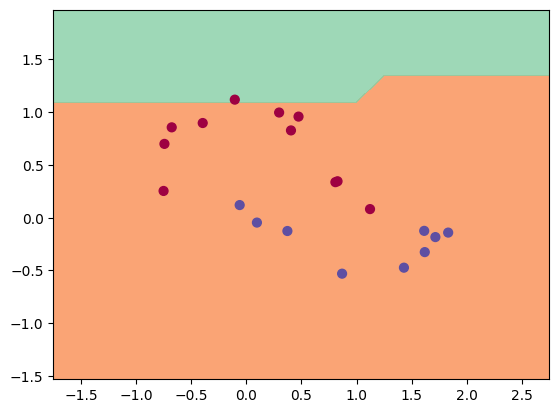
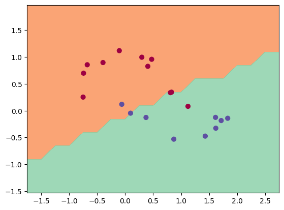
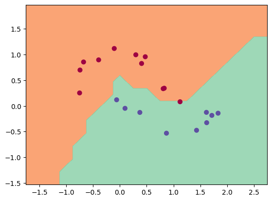
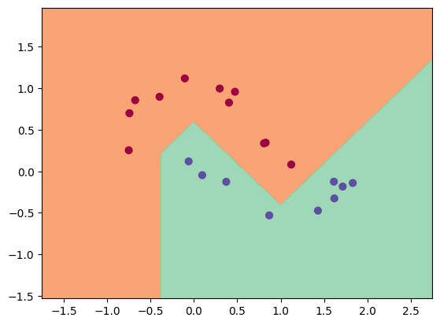

Binary Classification using Neural Networks

Training Sample

Test Output
1. Using a 1 layer MLP with hidden layer dimensions(2)
Test Data Set Performance
Epoch 9999, Avg Loss: 0.6931472420692444

2. Using a 2 layer MLP with hidden layer dimensions (2, 2)
Test Data Set Performance
Epoch 9999, Avg Loss: 0.4002770781517029

3. Using a 3 layer MLP with hidden layer dimensions (10, 4, 2)
Test Data Set Performance
Epoch 9999, Avg Loss: 0.16591086983680725

3. Using a 7 layer MLP with hidden layer dimensions (128, 64, 32, 16, 8, 4, 2)
Test Data Set Performance
Epoch 9999, Avg Loss: 0.12439274787902832
