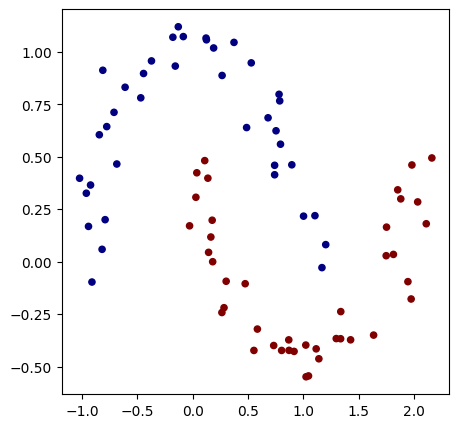
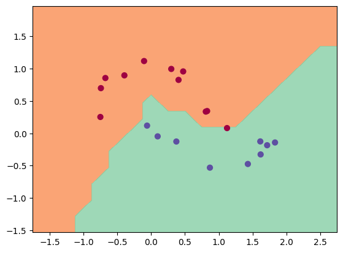
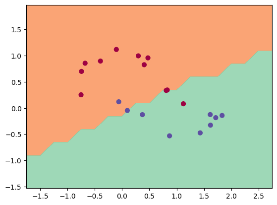
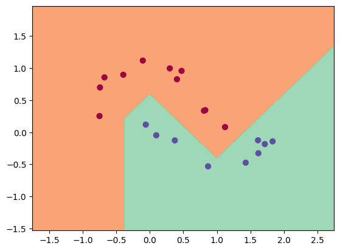
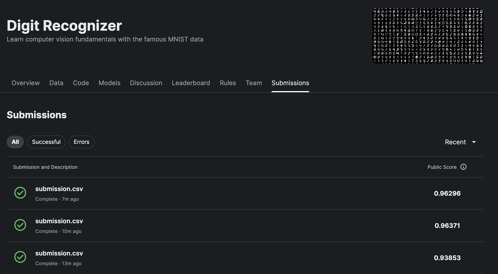

# Pre-training In Progress

1. [Binary Classification](#binary-classification-using-neural-networks)
2. [MNIST](#MNIST)

## Binary Classification using Neural Networks

### Training Sample

### Test Output

1. **Using a 1 layer MLP with hidden layer dimensions (2)**
    - Train Data Set Performance
      - Epoch 9999, Avg Loss: 0.6931472420692444
    - Test Result
    

2. **Using a 2 layer MLP with hidden layer dimensions (2, 2)**
    - Train Data Set Performance
      - Epoch 9999, Avg Loss: 0.4002770781517029
    - Test Result
    

3. **Using a 3 layer MLP with hidden layer dimensions (10, 4, 2)**
    - Train Data Set Performance
      - Epoch 9999, Avg Loss: 0.16591086983680725
    - Test Result
    

4. **Using a 7 layer MLP with hidden layer dimensions (128, 64, 32, 16, 8, 4, 2)**
    - Train Data Set Performance
      - Epoch 9999, Avg Loss: 0.12439274787902832
    - Test Result
    

## MNIST

1. **Using a 2 layer MLP with hidden layer dimensions (10, 10)**
    - Test Data Set Performance
      - Epoch 100, Accuracy: 93.3%

2. **Using a 2 layer MLP with hidden layer dimensions (128, 64)**
    - Test Data Set Performance
      - Epoch 100, Accuracy: 96.371%

3. **Using a 3 layer MLP with hidden layer dimensions (128, 64, 32)**
    - Test Data Set Performance
      - Epoch 100, Accuracy: 96.296%
